<p align="center">
  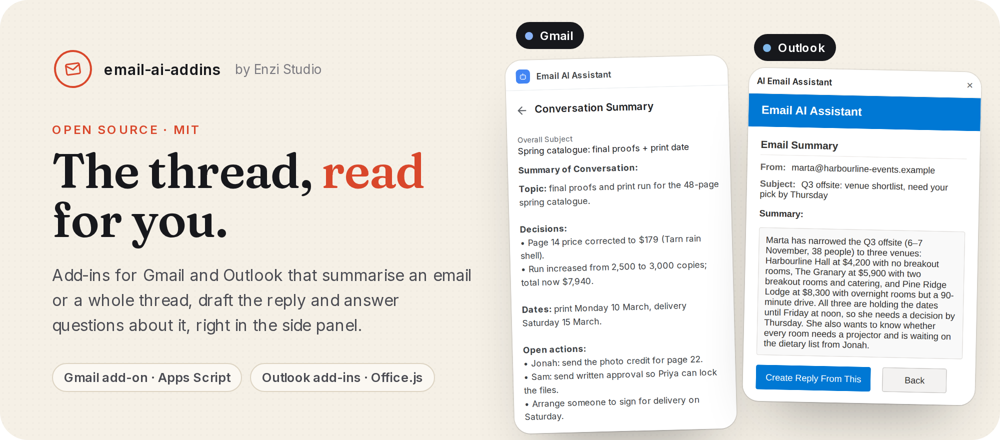
</p>

<p align="center">
  <a href="#quick-start"><b>Quick start</b></a> ·
  <a href="#what-it-does"><b>What it does</b></a> ·
  <a href="#how-it-works"><b>How it works</b></a> ·
  <a href="#configuration"><b>Config</b></a>
</p>

<p align="center">
  <a href="LICENSE"></a>
  
  
  
  
  
</p>

# Email AI add-ins

AI helpers that sit next to the email you have open, in Gmail and in Outlook. They summarise an email or a whole thread, draft the reply, and answer questions about the conversation, all from the side panel.

<p align="center">
  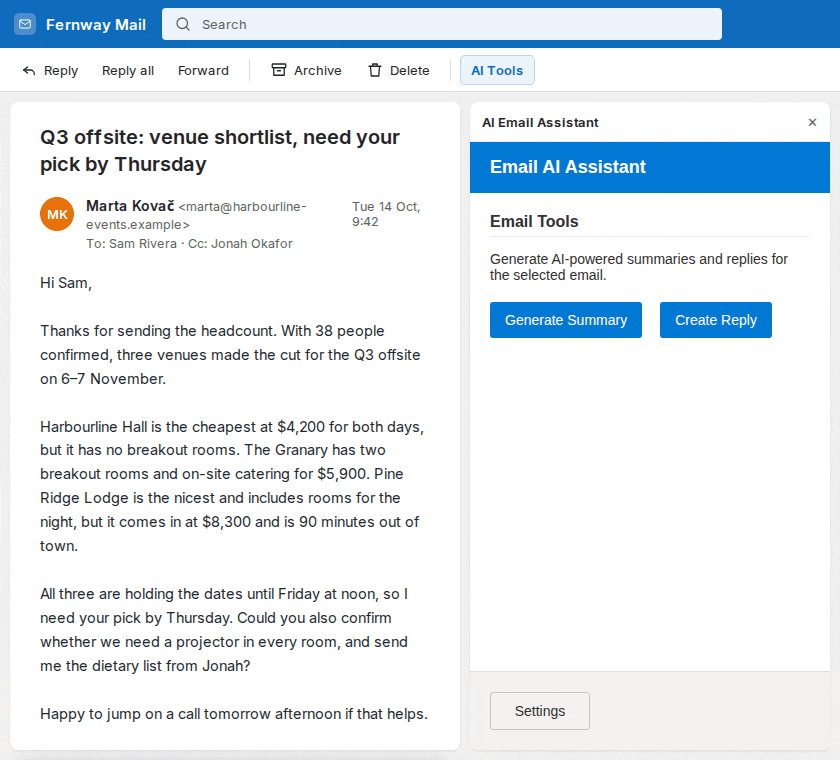
</p>

<sub>About the pictures: the add-in panels are the real code in this repo, built and running locally. The mail window around them is a <b>mock host</b> we built in HTML for the preview (it is not Gmail or Outlook), every email is invented, and the AI answers come from a local stand-in model so the run is repeatable. See <a href="tools/preview/">tools/preview</a>.</sub>

---

## What it does

<p align="center">
  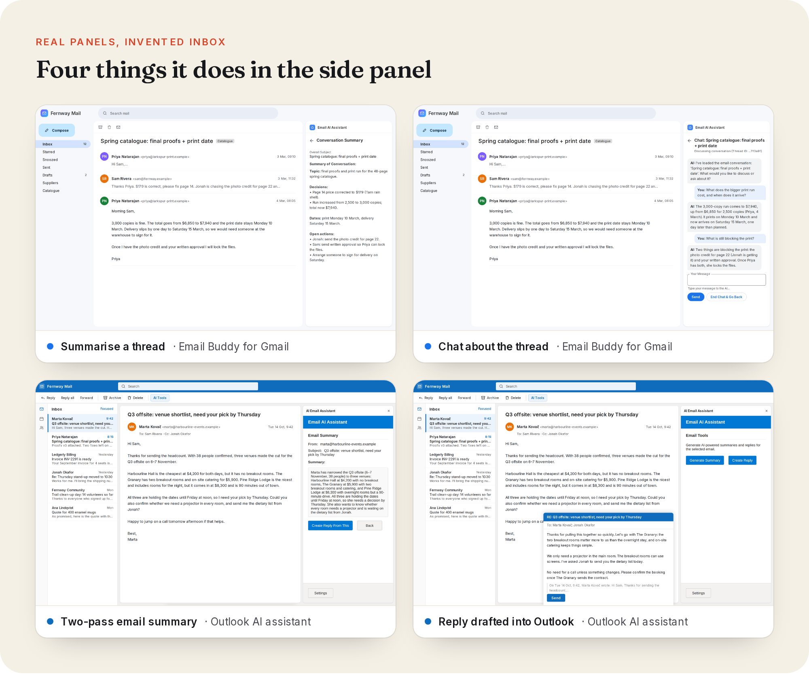
</p>

This repo holds three add-ins:

| Folder | Host | What it is |
| --- | --- | --- |
| [`gmail-email-buddy/`](gmail-email-buddy/) | Gmail | **Email Buddy**, a Google Workspace add-on in Apps Script. Summarise one email or the whole thread, draft a reply, chat about the conversation. |
| [`outlook-ai-assistant/`](outlook-ai-assistant/) | Outlook | **AI Email Assistant**, an Office.js task pane in TypeScript (from Microsoft's TaskPane template). Two-pass summary and a reply drafted into Outlook's reply-all form. |
| [`outlook-summarizer/`](outlook-summarizer/) | Outlook | **Email Summarizer**, the first Next.js prototype. Picks the first sentences of the email. No AI call. |

### Email Buddy for Gmail

- **Summarise this email** in two to four sentences.
- **Summarise the conversation.** It reads up to the last 25 messages and pulls out the topic, decisions, dates and open actions.
- **Create a reply.** The draft lands in an editable box. Save it as a Gmail draft or send it.
- **Chat about the conversation.** The thread is loaded as context (up to 800 characters per message, 7,000 in total) and the chat remembers what you asked.
- **Settings** card for your OpenAI key, stored in Apps Script script properties.

<table>
  <tr>
    <td width="50%">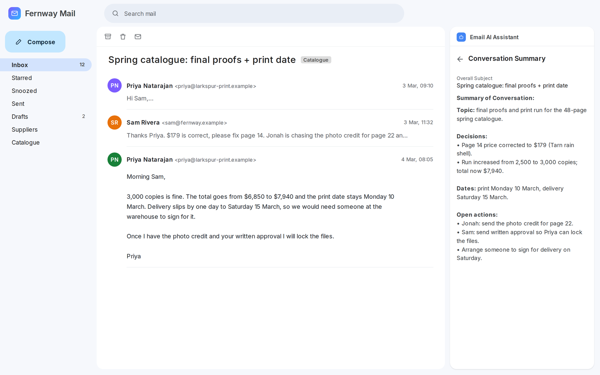</td>
    <td width="50%">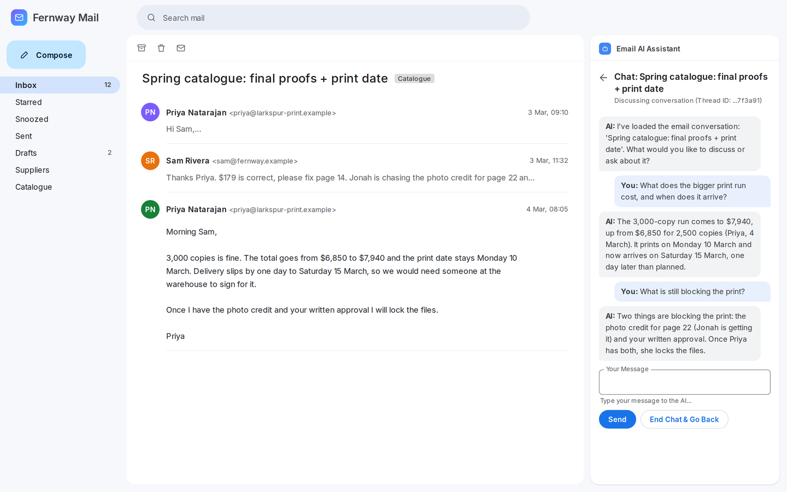</td>
  </tr>
  <tr>
    <td>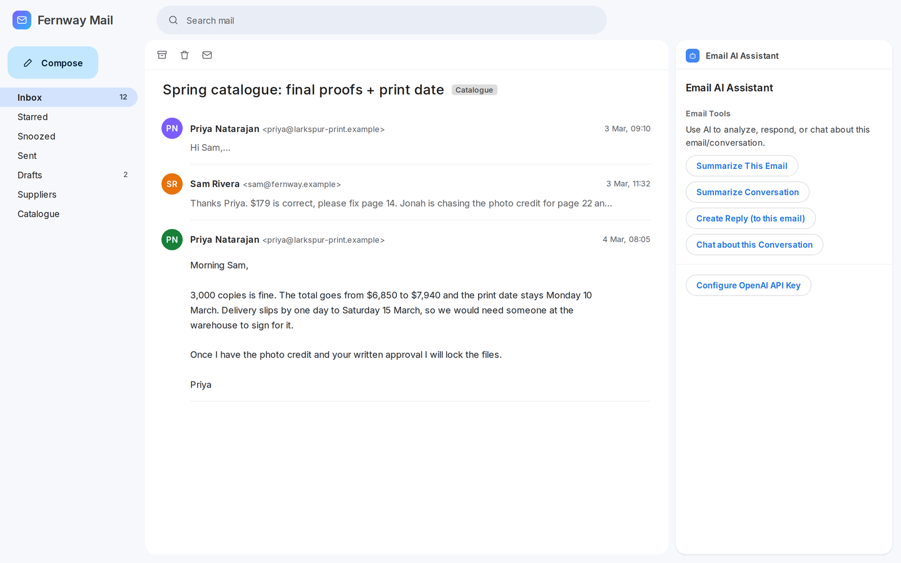</td>
    <td>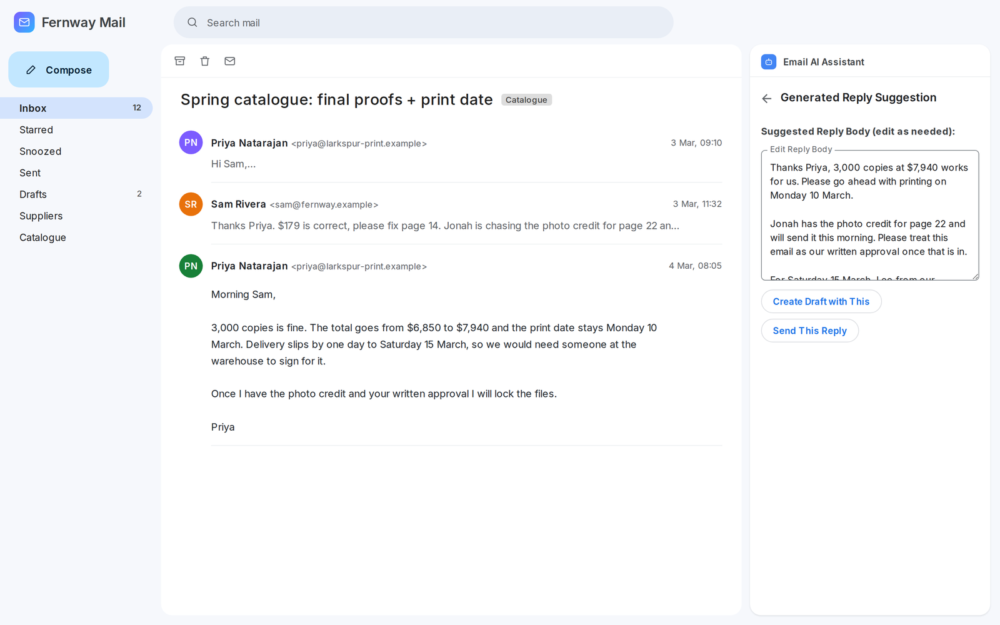</td>
  </tr>
</table>

### AI Email Assistant for Outlook

- **Generate summary** in two passes: first the key points, decisions and questions, then a short paragraph written from those points.
- **Create reply** with just the body text, so you add your own greeting and sign-off.
- **Open reply form with this** puts the draft into Outlook's own reply-all window. Nothing is sent until you press Send.
- **Settings** view for your OpenAI key, saved in Outlook roaming settings for your mailbox.

<table>
  <tr>
    <td width="50%">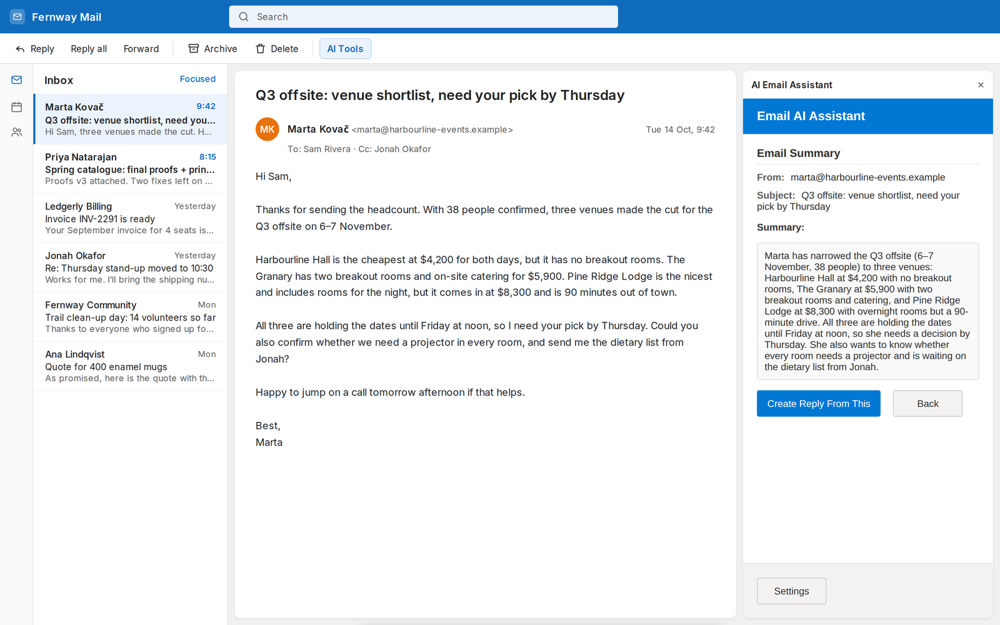</td>
    <td width="50%">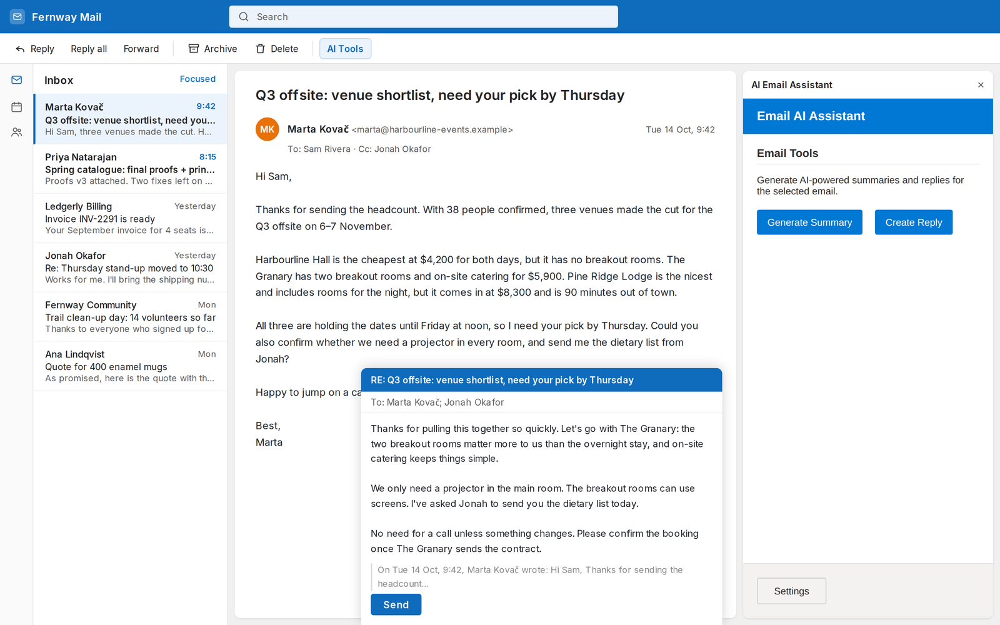</td>
  </tr>
</table>

### Email Summarizer (Next.js prototype)

The early version: a React task pane that cleans up the email text and shows its first sentences. It makes no network call, which makes it a small, readable starting point for your own Outlook add-in in Next.js.

<p align="center">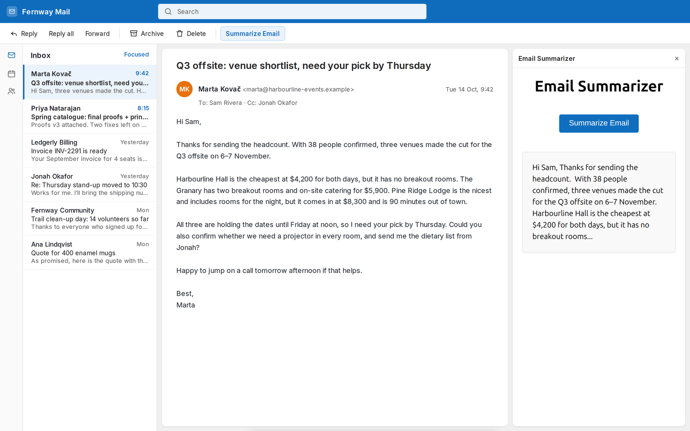</p>

---

## How it works

<p align="center">
  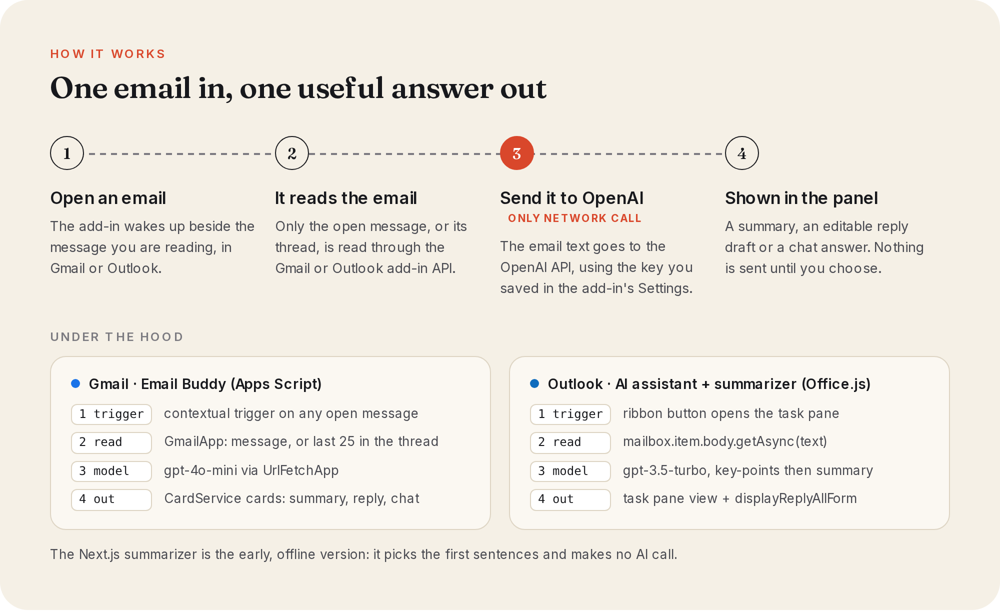
</p>

1. **Open an email.** Gmail shows Email Buddy through a contextual trigger. In Outlook you click the ribbon button and the task pane opens.
2. **The add-in reads it.** Email Buddy uses `GmailApp` for the message or the thread. The Outlook add-ins call `Office.context.mailbox.item.body.getAsync`.
3. **Send it to OpenAI.** Email Buddy calls `gpt-4o-mini` with `UrlFetchApp`. The Outlook assistant calls `gpt-3.5-turbo` with `fetch`. This is the only network call, and it uses your own key.
4. **Show it in the panel.** Email Buddy draws Apps Script cards. The Outlook assistant switches task pane views and can open `displayReplyAllForm` with the draft.

There is no server of ours in the middle and no database. Chat history in Email Buddy lives in Apps Script user properties and is deleted when you end the chat.

---

## Quick start

### 1. Try the preview (no Google or Microsoft account, no API key)

The preview runs all three add-ins inside the mock mail host, with invented emails and a stand-in model. Needs Node 18 or newer.

```bash
git clone https://github.com/enzihub/email-ai-addins.git
cd email-ai-addins

# build the Outlook AI assistant
(cd outlook-ai-assistant && npm ci && npm run build)

# build and start the Next.js summarizer on port 3102
(cd outlook-summarizer && npm install && npx next build)
(cd outlook-summarizer && npx next start -H 127.0.0.1 -p 3102) &

# start the preview host
node tools/preview/server.js
```

Then open:

- http://127.0.0.1:4310/?host=gmail (Email Buddy)
- http://127.0.0.1:4310/?host=outlook-ai (AI Email Assistant)
- http://127.0.0.1:4310/?host=summarizer (Email Summarizer)

What is real and what is mocked:

| Real | Mocked |
| --- | --- |
| The built Outlook task panes, served unchanged except that the Office.js script tag is swapped for the stub | The mail window ([`hosts/index.html`](tools/preview/hosts/index.html)) |
| `GetContextualAddOn.gs`, loaded unchanged into the page | Office.js ([`office-stub.js`](tools/preview/office-stub.js)) and Apps Script services ([`apps-script-shim.js`](tools/preview/apps-script-shim.js)) |
| | The emails ([`demo-data.js`](tools/preview/demo-data.js)) and the model ([`fake-openai.js`](tools/preview/fake-openai.js)) |

The Apps Script card styling in the preview is an approximation of how Gmail draws add-on cards.

### 2. Outlook AI assistant in a real mailbox

```bash
cd outlook-ai-assistant
npm ci
npx office-addin-dev-certs install   # creates and trusts a localhost certificate on your machine
npm run dev-server                   # https://localhost:3000
```

Then in Outlook: **Add-ins → My add-ins → Custom add-ins → Add from file** and pick `outlook-ai-assistant/manifest.xml`. Or let Microsoft's tooling do it: `npm start` (Outlook desktop on Windows or Mac). Open an email, click **AI Tools**, open **Settings** and paste your OpenAI key.

### 3. Outlook summarizer in a real mailbox

```bash
cd outlook-summarizer
npm install
npm run certs        # office-addin-dev-certs install
npm run dev:https    # Next.js behind HTTPS on https://localhost:3000
```

Sideload `outlook-summarizer/public/manifest.xml` the same way.

> No certificate or private key is stored in this repo. `office-addin-dev-certs` writes a fresh one to `~/.office-addin-dev-certs` on your own machine and asks your OS to trust it. Remove it later with `npx office-addin-dev-certs uninstall`.

### 4. Email Buddy in Gmail

1. Go to [script.google.com](https://script.google.com/) and create a new project.
2. Copy `gmail-email-buddy/GetContextualAddOn.gs` into the editor.
3. Turn on **Project Settings → Show "appsscript.json" manifest file** and replace it with `gmail-email-buddy/appsscript.json`.
4. **Deploy → Test deployments → Gmail → Install**, then accept the permissions.
5. Refresh Gmail, open an email, open the add-on and click **Configure OpenAI API Key**.

Or use [clasp](https://github.com/google/clasp): `clasp create --type standalone`, copy both files in, `clasp push`.

---

## Configuration

None of the add-ins read environment variables or ship with a key. Each one asks the user for their own OpenAI key and keeps it in the host:

| Add-in | Where the key lives | Model | Change it in |
| --- | --- | --- | --- |
| Email Buddy | Apps Script **script properties**, `OPENAI_API_KEY` | `gpt-4o-mini` | `OPENAI_MODEL` in `GetContextualAddOn.gs` |
| AI Email Assistant | Outlook **roaming settings**, `openai_api_key_v1` | `gpt-3.5-turbo` | `callOpenAI()` in `src/taskpane/taskpane.ts` |
| Email Summarizer | No key, no model | | `createSimpleSummary()` in `pages/index.tsx` |

Other settings:

| Setting | Where | Default |
| --- | --- | --- |
| Dev server port (Outlook assistant) | `config.dev_server_port` in `outlook-ai-assistant/package.json` | `3000` |
| Production URL for the Outlook assistant manifest | `urlProd` in `outlook-ai-assistant/webpack.config.js` | `https://www.contoso.com/` (placeholder) |
| HTTPS port (summarizer) | `PORT` env var for `npm run dev:https` | `3000` |
| Preview ports | `PREVIEW_PORT`, `NEXT_PORT`, `PREVIEW_MODEL_DELAY_MS` | `4310`, `3102`, `700` |

### Privacy and security notes

- The add-ins send the text of the open email (or thread) to OpenAI. Do not use them on mail you are not allowed to share with a third party.
- Email Buddy stores **one key per Apps Script project** in script properties, so everyone who installs the same deployment shares it. For a team, move the key to user properties or a proxy you control.
- The Outlook assistant calls OpenAI from the browser with the user's key in the request. That is fine for a personal tool. For anything shared, put a small server in front so the key never reaches the client.
- Email Buddy's manifest asks for the broad `https://mail.google.com/` scope because it can send replies. Trim the scopes if you remove sending.

---

## Project layout

```
gmail-email-buddy/        Apps Script Gmail add-on (Email Buddy)
outlook-ai-assistant/     Office.js task pane, TypeScript + webpack
outlook-summarizer/       Next.js 13 task pane prototype + HTTPS dev server
tools/preview/            mock mail host, Office.js stub, Apps Script shim, fake model
tools/capture/            headless Playwright scripts for the screenshots and GIF
tools/art/                source for the README art (rendered with Playwright)
docs/                     the project website (static; open docs/index.html)
assets/                   README images
```

## Status

Built by Enzi Studio in 2025 and shared as-is. It works, it is small, and it is a good base for your own inbox tools, but it is not maintained as a product. The Outlook add-ins use OpenAI model names from 2025; swap in a current model before you rely on them. Issues and pull requests are welcome.

## Credits

Built by **Enzi Studio**.

Contributors to the original repos: [@RukshanJS](https://github.com/RukshanJS) and [@bb-xops](https://github.com/bb-xops).

`outlook-ai-assistant` started from Microsoft's [Office Add-in TaskPane template](https://github.com/OfficeDev/Office-Addin-TaskPane) (MIT). The website and art use [Inter](https://github.com/rsms/inter) and [Fraunces](https://github.com/undercasetype/Fraunces) under the SIL Open Font License.

Gmail is a trademark of Google LLC and Outlook is a trademark of Microsoft Corporation. This project is not affiliated with or endorsed by either company.

## Licence

[MIT](LICENSE) © 2025-2026 Enzi Studio (Harry Edwards). Third-party notices are in [NOTICE](NOTICE).
